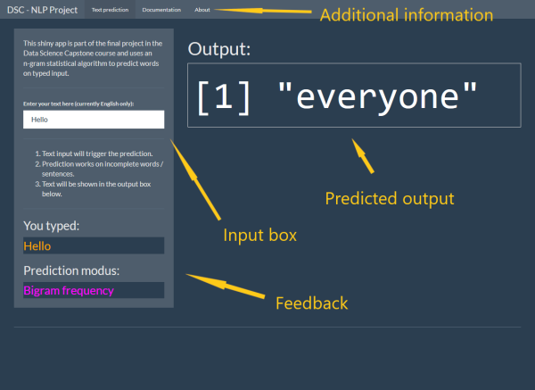

##  executive summary - what is this project about
The goal of this project was to create a shiny web app that makes the predictive n-gram model,
that was build during the course, accessible by deploying a [shiny web app](https://www.shinyapps.io/).

### preparatory work
- a corpus of twitter posts, news and blog posts was build from mined data
- for this purpose the R packages `tm` and `RWeka` were used
- the nlp algorithm used is an [n-gram](https://en.wikipedia.org/wiki/N-gram) probabilistic model
- this algorithm is not to complex and very versatile and can be deployed on systems with limited computational resources
- an exploratory analysis was conducted in week 2 to explore the data set and its features
- various possibilities for the improvement of speed and accuracy  of the model were explored and balanced to create a responsive experience in the app

--- .class #id 

## brief explanation of the model
- preprocessed user input is fed to the algorithm (preprocessing included among others de-capitalization, removing non-letter symbols, etc.)
- a maximum of the last 4 words of user input is kept (quadgram)
- if certain conditions are not met the algorithm is backing off to shorter history model to make predictions
- the model iterates from longest n-gram (4-gram) to shortest (2-gram)
- by doing so the algorithm provides the best prediction under the constraints of the conditions given
- for this project I had mainly computational constraints which made it important that the algorithm is responsive rather than extremely accurate
- in the current state the model is only trained with an English corpus, but in the future I want to expand the model / app to include more languages

--- .class #id

## short description of the app

- provides a text input field for a user to type a word / phrase

- the app detects the words and predicts the next word reactively

- inconclusive warning if the algorithm fails to make a proper prediction

- prediction uses the the longest, most frequent, matching n-gram

- the app has a documentation tap with informative links regarding the topic

--- .class #id

<figure style='text-align: center;'>
  
  <figcaption>Screenshot of the user interface.</figcaption>
</figure> 

- link to the app: [xburaw.shinyapps.io/c10shinyapp/](https://xburaw.shinyapps.io/c10shinyapp/)
- response time ~1 second
- memory usage ca. 30 mb
